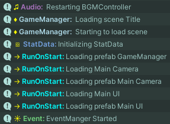
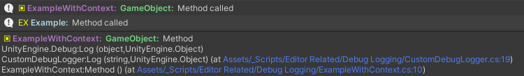

## Decorated Debug.Log for Unity
by **Zach Blaker** / [Twitter](https://twitter.com/Sleepless_Dev)  / [Bluesky](https://bsky.app/profile/sleepless-dev.bsky.social) 



----
### Examples

Basic

```csharp
#define debug
using static CustomDebugLogger;

[CustomDebug("Example", "lightblue", "EX")]
public class Example 
{
    public void Method()
    {
        Log("Method called");
    }
}
```

With context, enables clicking on message in console to highlight the object in the hierarchy
```csharp
#define debug
using UnityEngine;
using static CustomDebugLogger;

[CustomDebug("ExampleWithContext", "#aa73bf", "▣")]
public class ExampleWithContext : MonoBehaviour
{
    public void Method()
    {
        Log("Method called", this);
    }
}
```

